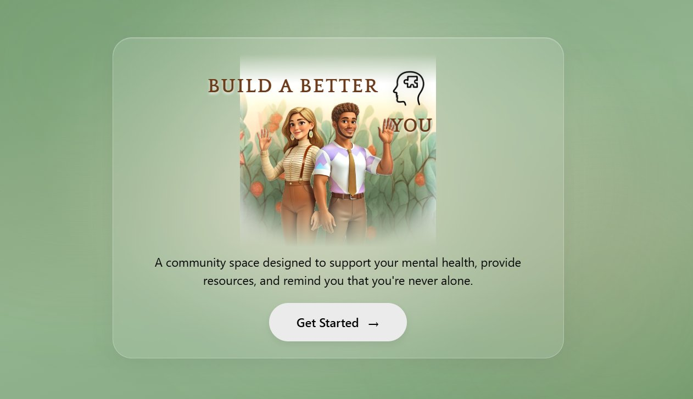
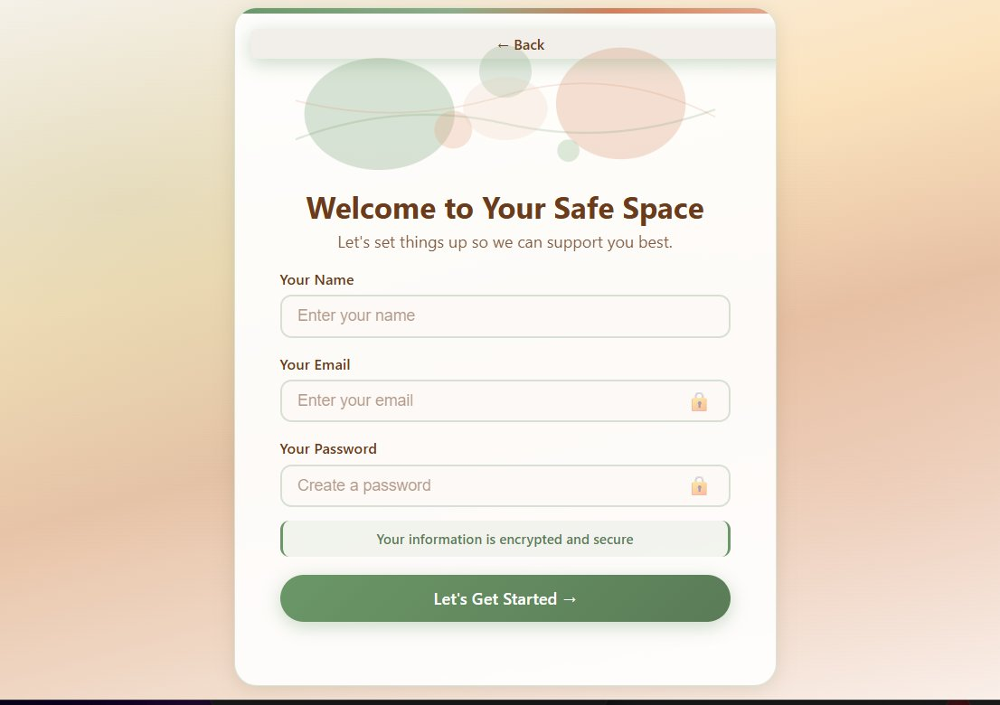
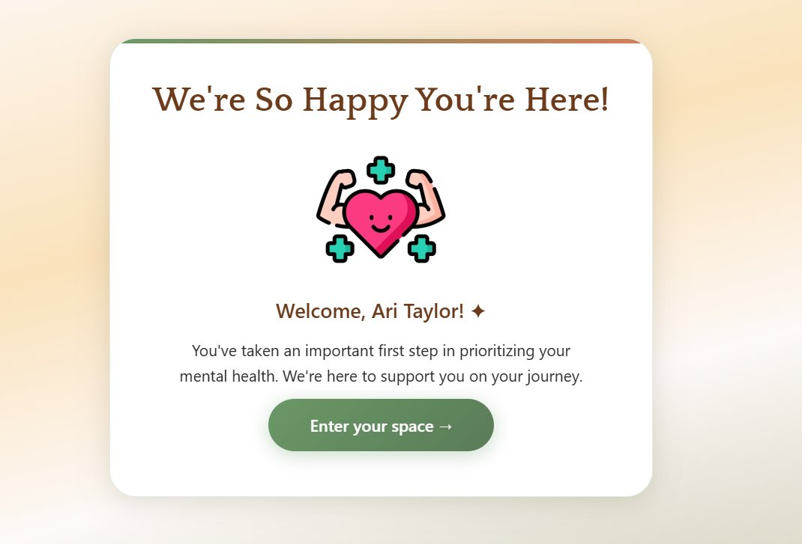
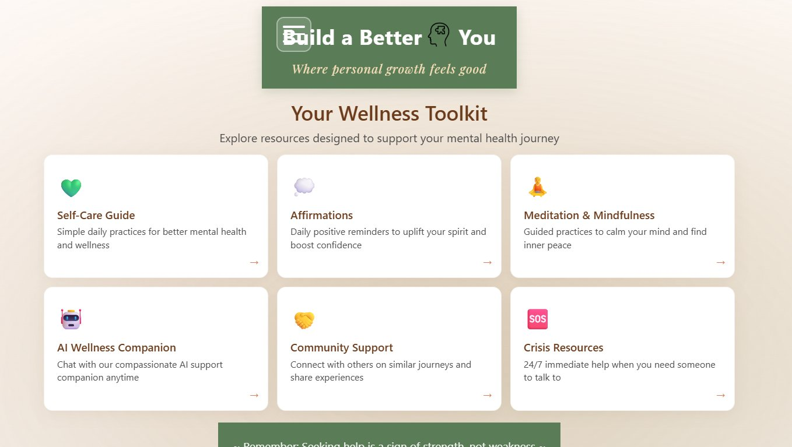
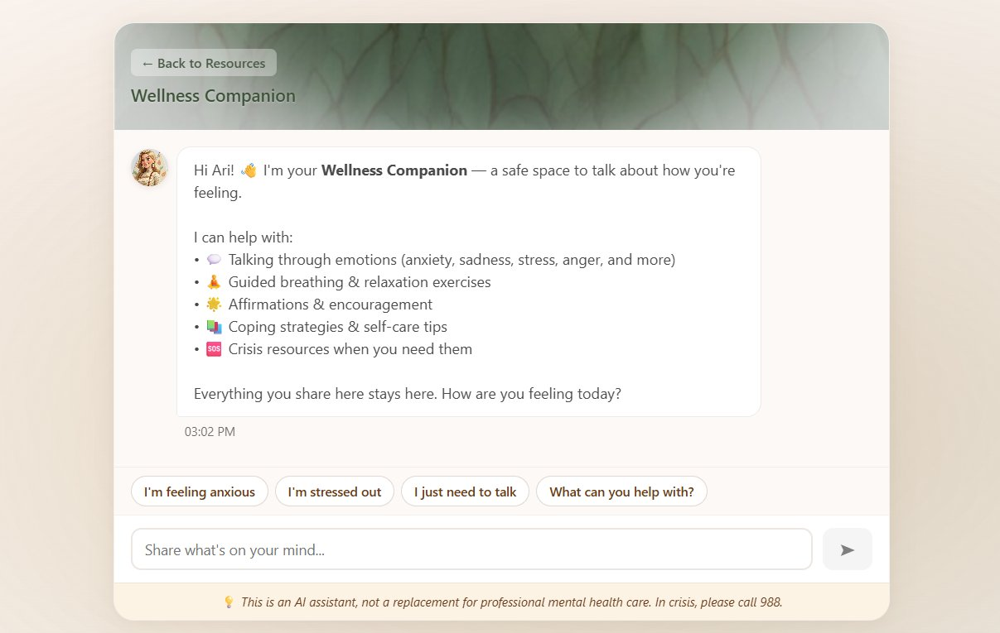

# Build a Better You
# all-in-One Mental Health App

> **Status:** Work in Progress

**Repository:** [https://github.com/ari-trinity/mental-health-app.git](https://github.com/ari-trinity/mental-health-app.git)

---

## Table of Contents

- [About](#about)
- [Features](#features)
- [Screenshots](#screenshots)
- [Tech Stack](#tech-stack)
- [Installation](#installation)
- [Usage](#usage)
- [Contributing](#contributing)

---

## About

**Build a Better You** is a mental health application created with an ambition to help others by providing a variety of wellness support all in one place.

This application has a combination of self-care tools, helpful resources, and a supportive community. Whether you're just getting started or looking for a little extra support, Build a Better You is for anyone and everyone – no matter what stage of the journey they're in.

At the heart of the app is a safe community built around real connection – a space where users can share their wins and progress, talk about what they're dealing with, and know that they are never alone.

---

## Features

- **AI Chatbox** – Release your thoughts and emotions with Ava, a kind and supportive AI companion.
- **Community Support** – Connect with others in a safe and supportive space and know that you are never alone.
- **Mental Health Resources** – A variety of articles, guides, and tools to help build the version of "you" that you want to be.
- **User Login** – Get a more personalized experience with secure account creation and login.
- **Daily Affirmations** – Generate uplifting, hopeful, and inspiring messages to start your day with real intention.
- **Meditation & Mindfulness** – *Coming Soon!*

---

## Screenshots

**Landing Page**


**Sign Up**


**Welcome Screen**


**Wellness Toolkit Dashboard**


**AI Wellness Companion (Chatbox)**



---

## Tech Stack

| Layer | Technology |
|---|---|
| Frontend | Svelte |
| Styling | CSS / Glassmorphism |
| Build Tool | Vite |
| Deployment | GitHub Pages |

---

## Installation

1. **Clone the repository**
   ```bash
   git clone https://github.com/ari-trinity/mental-health-app.git
   ```

2. **Navigate into the project folder**
   ```bash
   cd mental-health-app
   ```

3. **Install dependencies**
   ```bash
   npm install
   ```

4. **Start the development server**
   ```bash
   npm run dev
   ```

---

## Usage

1. Create an account or log in.
2. Explore the **Affirmations** section to start your day with intention.
3. Open up to **Ava** (our AI chatbox) and talk about what has been going on recently.
4. Join the **Community** to connect with others.
5. Check out the **Meditation & Mindfulness** section for a mental and physical reset.

---

## Contributing

Contributions, ideas, and feedback are welcome! Feel free to open an issue or submit a pull request.

---

## Author

**Ari Taylor** | Full-Stack Web Development | Atlas

- [LinkedIn: linkedin.com/in/ari-taylor-8b8382366](https://linkedin.com/in/ari-taylor-8b8382366)
- Email: aritrin.business@gmail.com
- GitHub: [@ari-trinity](https://github.com/ari-trinity)


# Svelte + Vite

This template should help get you started developing with Svelte in Vite.

## Recommended IDE Setup

[VS Code](https://code.visualstudio.com/) + [Svelte](https://marketplace.visualstudio.com/items?itemName=svelte.svelte-vscode).

## Need an official Svelte framework?

Check out [SvelteKit](https://github.com/sveltejs/kit#readme), which is also powered by Vite. Deploy anywhere with its serverless-first approach and adapt to various platforms, with out of the box support for TypeScript, SCSS, and Less, and easily-added support for mdsvex, GraphQL, PostCSS, Tailwind CSS, and more.

## Technical considerations

**Why use this over SvelteKit?**

- It brings its own routing solution which might not be preferable for some users.
- It is first and foremost a framework that just happens to use Vite under the hood, not a Vite app.

This template contains as little as possible to get started with Vite + Svelte, while taking into account the developer experience with regards to HMR and intellisense. It demonstrates capabilities on par with the other `create-vite` templates and is a good starting point for beginners dipping their toes into a Vite + Svelte project.

Should you later need the extended capabilities and extensibility provided by SvelteKit, the template has been structured similarly to SvelteKit so that it is easy to migrate.

**Why include `.vscode/extensions.json`?**

Other templates indirectly recommend extensions via the README, but this file allows VS Code to prompt the user to install the recommended extension upon opening the project.

**Why enable `checkJs` in the JS template?**

It is likely that most cases of changing variable types in runtime are likely to be accidental, rather than deliberate. This provides advanced typechecking out of the box. Should you like to take advantage of the dynamically-typed nature of JavaScript, it is trivial to change the configuration.

**Why is HMR not preserving my local component state?**

HMR state preservation comes with a number of gotchas! It has been disabled by default in both `svelte-hmr` and `@sveltejs/vite-plugin-svelte` due to its often surprising behavior. You can read the details [here](https://github.com/sveltejs/svelte-hmr/tree/master/packages/svelte-hmr#preservation-of-local-state).

If you have state that's important to retain within a component, consider creating an external store which would not be replaced by HMR.

